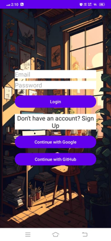
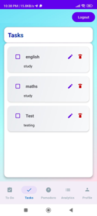
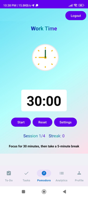
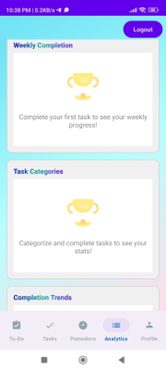
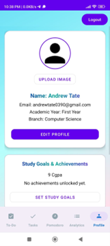
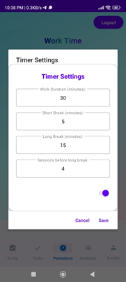
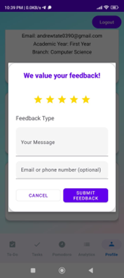
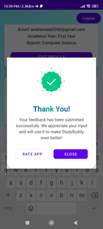

# 📚 Study Buddy - Your Ultimate Study Companion

<div align="center">
  
  
  
  
  
  
  
</div>

## 🚀 Overview

**Study Buddy** is a comprehensive Android productivity application designed to help students manage their studies efficiently. Built with modern Android development practices using Kotlin and MVVM architecture, it combines task management, time tracking, and analytics in one powerful app.

## ✨ Key Features

### 📝 Smart Task Management
- ✅ Create, edit, and organize tasks with custom categories
- 🏷️ Advanced filtering system for better task organization
- ⏱️ Automatic completion tracking with timestamps
- 👀 Visual progress indicators and completion status
- 💾 Reliable local storage with cloud sync capabilities
- 🔄 Real-time task synchronization across devices
- 📅 Due date reminders and notifications
- 🏆 Task completion streaks and achievements

### 🍅 Pomodoro Timer
- ⏲️ Fully customizable work and break intervals
- 🔥 Session streak tracking to maintain momentum
- 🔔 Smart notification system for seamless transitions
- 📊 Detailed session analytics and performance insights
- ⚙️ Persistent timer settings tailored to your workflow
- 🎵 Background music integration for focus
- 📈 Productivity tracking and goal setting
- ⏰ Custom timer presets for different study sessions

### 📊 Comprehensive Analytics
- 📈 Beautiful interactive charts showing your progress
- 📉 Detailed productivity statistics and trends
- 📅 Daily, weekly, and monthly completion insights
- ⏰ Time tracking with detailed breakdowns
- 🎯 Goal achievement visualization
- 📊 Study pattern analysis and recommendations
- 📈 Performance metrics and improvement tracking
- 🏆 Achievement badges and milestones

### 👤 Personalized Profile
- 🖼️ Custom profile pictures with cloud storage
- 🎓 Academic information and study preferences
- 🎯 Personal goal setting and achievement tracking
- 💬 Integrated feedback system for continuous improvement
- 🌙 Dark/Light theme customization
- 🔔 Notification preferences and settings
- 📱 Widget customization and home screen integration
- 👥 Study group and collaboration features

### 🎵 Music Integration *(Coming Soon)*
- 🎶 Lofi music streaming for enhanced focus
- 🎵 Custom playlist creation and management
- 🔊 Background music with timer integration
- 🎧 Audio controls and volume management
- 📻 Multiple music sources and streaming options
- 🔄 Offline music support for uninterrupted study
- ⏳ *This feature is currently in development and will be available in future updates*

## 🏗️ Technical Excellence

**Study Buddy** is built with modern Android development best practices:

- **Architecture**: MVVM pattern with proper separation of concerns
- **UI Framework**: XML layouts with Data Binding and Jetpack Compose components
- **Backend**: Firebase integration for authentication, database, and storage
- **Charts & Analytics**: MPAndroidChart for rich data visualization
- **Animations**: Lottie animations for smooth user experience
- **Offline Support**: Local-first approach with cloud synchronization
- **Database**: Room database for local data persistence
- **Networking**: OkHttp for efficient network communication
- **Image Loading**: Glide for optimized image handling
- **Dependency Injection**: Manual DI with proper lifecycle management

## 📱 App Experience

### Seamless Navigation
Navigate through four main sections using the intuitive bottom navigation:
- 📝 **Tasks**: Manage your to-do list and assignments
- 🍅 **Pomodoro**: Focus with scientifically-proven time management
- 📊 **Analytics**: Track your productivity and progress
- 👤 **Profile**: Customize your study experience

### User-Friendly Design
- 🎨 Material Design principles with custom theming
- 📳 Haptic feedback and smooth animations
- 🔔 Smart notifications that don't interrupt your flow
- ♿ Accessible design for all users
- 🚀 Fast performance with efficient data handling
- 🌙 Adaptive theming based on system preferences
- 📱 Responsive design for all screen sizes
- 🎭 Smooth transitions and micro-interactions

## 🛠️ Installation & Setup

### For End Users

#### Method 1: Direct APK Installation
1. Download the latest APK from [Releases](https://github.com/ashutosh48555/Study-Buddy/releases)
2. Enable "Install from unknown sources" in your device settings
3. Install the APK on your Android device (Android 7.0+ required)
4. Launch the app and start your productivity journey!

#### Method 2: Google Play Store (Coming Soon)
- Search for "Study Buddy" on Google Play Store
- Install and launch the app
- Sign up with your Google account for cloud sync

### For Developers

#### Prerequisites
- **Android Studio** (Arctic Fox or later)
- **JDK 17** or later
- **Android SDK** (API 24 or later)
- **Git** for version control

#### Setup Instructions
1. **Clone the repository**
   ```bash
   git clone https://github.com/ashutosh48555/Study-Buddy.git
   cd Study-Buddy
   ```

2. **Open in Android Studio**
   - Launch Android Studio
   - Click "Open an existing project"
   - Navigate to the cloned Study-Buddy folder
   - Click "OK"

3. **Sync Project**
   - Android Studio will automatically detect the Gradle files
   - Click "Sync Now" when prompted
   - Wait for the sync to complete (this may take a few minutes)

4. **Configure Firebase (Optional)**
   - Go to [Firebase Console](https://console.firebase.google.com/)
   - Create a new project or use existing one
   - Add Android app with package name: `com.example.studybuddy`
   - Download `google-services.json` and replace the existing one in `app/` directory

5. **Build and Run**
   - Connect an Android device or start an emulator
   - Click the "Run" button (green play icon) or press `Shift + F10`
   - Select your target device
   - The app will build and install automatically

#### Verification
Run the verification script to ensure everything is set up correctly:
```bash
# On Windows
.\verify-setup.ps1

# On macOS/Linux
chmod +x verify-setup.sh
./verify-setup.sh
```

## 📸 Screenshots

<div align="center">
  <h3>🎨 Beautiful User Interface</h3>
  <p>Experience the modern, intuitive design of Study Buddy</p>
</div>

### 🔐 Authentication & Login
<div align="center">
  
  <p><em>Secure login with Google and GitHub integration</em></p>
</div>

### 📱 Main Application Screens
<div align="center">
  <table>
    <tr>
      <td align="center">
        
        <p><strong>Tasks</strong><br><em>Smart task management</em></p>
      </td>
      <td align="center">
        
        <p><strong>Pomodoro Timer</strong><br><em>Focus with time management</em></p>
      </td>
    </tr>
    <tr>
      <td align="center">
        
        <p><strong>Analytics</strong><br><em>Track your progress</em></p>
      </td>
      <td align="center">
        
        <p><strong>Profile</strong><br><em>Personalize your experience</em></p>
      </td>
    </tr>
  </table>
</div>

### ⚙️ Settings & Features
<div align="center">
  <table>
    <tr>
      <td align="center">
        
        <p><strong>Timer Settings</strong><br><em>Customize your study sessions</em></p>
      </td>
      <td align="center">
        
        <p><strong>Feedback System</strong><br><em>Help us improve the app</em></p>
      </td>
    </tr>
  </table>
</div>

### 🎉 User Experience
<div align="center">
  
  <p><em>Seamless user experience with beautiful animations</em></p>
</div>

## 🎨 App Flow

**Study Buddy** provides a smooth, intuitive experience:

```
🎬 Splash Screen → 🔐 Authentication → 🏠 Dashboard → 📝 Productivity Tools
```

### Detailed User Journey
1. **Splash Screen**: Beautiful animated welcome with app branding
2. **Authentication**: Secure login with Google or email/password
3. **Onboarding**: Quick setup for preferences and goals
4. **Main Dashboard**: Overview of tasks, timer, and progress
5. **Task Management**: Create, edit, and organize study tasks
6. **Pomodoro Timer**: Focused study sessions with breaks
7. **Analytics**: Track progress and productivity insights
8. **Profile**: Customize settings and preferences

## 🌟 What Makes It Special

- **Offline-First**: Works perfectly without internet connection
- **Smart Sync**: Automatic cloud backup when online
- **Customizable**: Adapt the app to your study style
- **Analytics-Driven**: Make data-informed decisions about your study habits
- **Student-Focused**: Built by students, for students
- **Privacy-Focused**: Your data stays secure and private
- **Performance-Optimized**: Smooth experience on all devices
- **Accessibility**: Designed for users with different abilities

## 🔮 Future Enhancements

### 🚀 Coming Soon
- 🎵 **Music Integration** - Lofi music streaming and custom playlists
- 📱 **Home screen widgets** for quick access
- 🎮 **Gamification elements** and achievements
- 📊 **Advanced analytics** with AI insights

### 🔮 Planned Features
- 🤝 Study group collaboration features
- 🔄 Data export and backup options
- 🌍 Multi-language support
- 📱 iOS version development
- 📚 Study material organization
- 🏆 Social features and leaderboards

## 🧪 Testing

### Running Tests
```bash
# Unit tests
./gradlew test

# Instrumented tests
./gradlew connectedAndroidTest

# All tests
./gradlew check
```

### Test Coverage
- Unit tests for business logic
- Instrumented tests for UI components
- Integration tests for Firebase services
- Performance tests for smooth operation

## 🤝 Contributing

We welcome contributions from the community! Here's how you can help:

### How to Contribute
1. Fork the repository
2. Create a feature branch (`git checkout -b feature/amazing-feature`)
3. Make your changes
4. Add tests for new functionality
5. Commit your changes (`git commit -m 'Add amazing feature'`)
6. Push to the branch (`git push origin feature/amazing-feature`)
7. Open a Pull Request

### Contribution Guidelines
- Follow Kotlin coding conventions
- Write meaningful commit messages
- Add tests for new features
- Update documentation as needed
- Ensure all tests pass before submitting

### Reporting Issues
When reporting issues, please include:
- Android version and device information
- Steps to reproduce the problem
- Expected vs actual behavior
- Screenshots or screen recordings if applicable

## 📄 License

This project is licensed under the MIT License - see the [LICENSE](LICENSE) file for details.

## 👨‍💻 Development Team

<div align="center">
  <h3>Meet the Study Buddy Development Team</h3>
  <p>Passionate developers creating the ultimate study companion</p>
</div>

<table align="center">
  <tr>
    <td align="center">
      
      <br><strong>Ashutosh</strong>
      <br>Lead Developer
      <br>
      <a href="https://github.com/ashutosh48555" target="_blank">
        
      </a>
      <a href="https://linkedin.com/in/ashutosh48555" target="_blank">
        
      </a>
    </td>
    <td align="center">
      
      <br><strong>Yogita</strong>
      <br>UI/UX Developer
      <br>
      <a href="https://github.com/yogita-0204" target="_blank">
        
      </a>
      <a href="https://linkedin.com/in/yogita-yadav-7199b2353" target="_blank">
        
      </a>
    </td>
    <td align="center">
      
      <br><strong>Saransh</strong>
      <br>Backend Developer
      <br>
      <a href="https://github.com/saransh" target="_blank">
        
      </a>
      <a href="https://linkedin.com/in/saransh" target="_blank">
        
      </a>
    </td>
  </tr>
  <tr>
    <td align="center">
      
      <br><strong>Devangi</strong>
      <br>Frontend Developer
      <br>
      <a href="https://github.com/devangi" target="_blank">
        
      </a>
      <a href="https://linkedin.com/in/devangi" target="_blank">
        
      </a>
    </td>
    <td align="center">
      
      <br><strong>Vivek</strong>
      <br>Full Stack Developer
      <br>
      <a href="https://github.com/vivek" target="_blank">
        
      </a>
      <a href="https://linkedin.com/in/vivek" target="_blank">
        
      </a>
    </td>
    <td align="center">
      
      <br><strong>Team</strong>
      <br>Collaboration
      <br>
      <a href="https://github.com/ashutosh48555/Study-Buddy" target="_blank">
        
      </a>
    </td>
  </tr>
</table>

<div align="center">
  <h4>🔗 Quick Links</h4>
  <p>
    <a href="https://github.com/ashutosh48555/Study-Buddy/issues">Report a Bug</a>
    ·
    <a href="https://github.com/ashutosh48555/Study-Buddy/discussions">Join Discussion</a>
    ·
    <a href="https://github.com/ashutosh48555/Study-Buddy/pulls">Contribute</a>
  </p>
</div>

## 🙏 Acknowledgments

Special thanks to the open-source community and the libraries that make this app possible:

- **Firebase** for backend services and authentication
- **MPAndroidChart** for beautiful analytics and charts
- **Lottie** for smooth animations and micro-interactions
- **Material Design** for UI components and guidelines
- **Room** for local database management
- **Glide** for efficient image loading
- **OkHttp** for network communication
- **Jetpack Compose** for modern UI development

## 📊 Project Statistics

- **36** Kotlin source files
- **75** XML resource files
- **8** JSON configuration files
- **100%** Kotlin codebase
- **MVVM** architecture pattern
- **Firebase** integration
- **Material Design** UI

## 🚀 Getting Started

Ready to boost your productivity? Here's how to get started:

1. **Download** the app from the releases section
2. **Install** on your Android device
3. **Sign up** with your Google account
4. **Set up** your study preferences
5. **Start** your first Pomodoro session
6. **Track** your progress with analytics
7. **Achieve** your study goals!

---

<div align="center">
  <p>Made with ❤️ for students everywhere</p>
  <p>⭐ Star this repo if you found it helpful!</p>
  <p><strong>Start your productive study journey today!</strong></p>
  
  <p>
    <a href="https://github.com/ashutosh48555/Study-Buddy/issues">Report Bug</a>
    ·
    <a href="https://github.com/ashutosh48555/Study-Buddy/issues">Request Feature</a>
    ·
    <a href="https://github.com/ashutosh48555/Study-Buddy/discussions">Join Discussion</a>
  </p>
</div>
